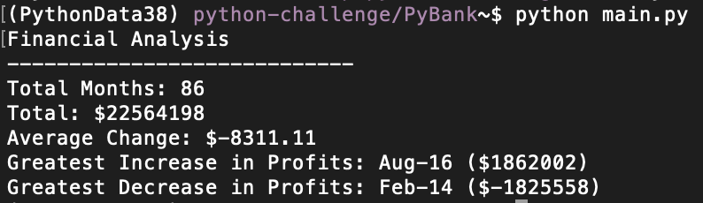
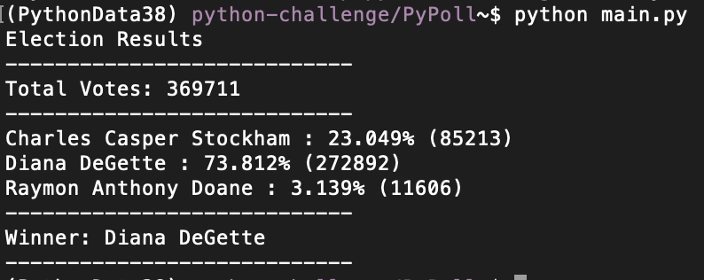

# Python Challenges
This repo contains two analyses - PyBank and PyPoll.

## PyBank 
This analysis summarizes profit changes for `budget_data.csv` and returns the following output:

  

## PyPoll 
This analysis calculates votes per candidate and winner from `election_data.csv` dataset and returns the following output:

Source data is in the `Resources` folder and a summary text file is in the `analysis` folder for each analysis.